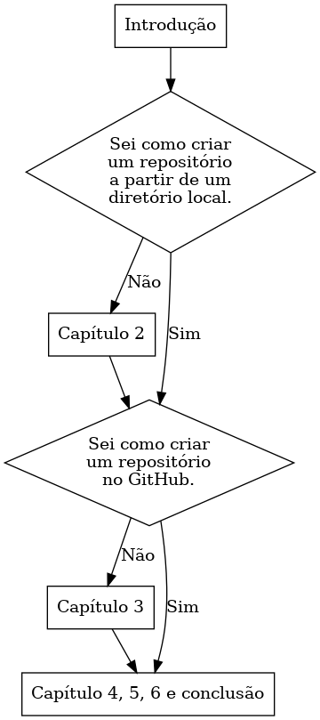

:imagesdir: ./images
[#intro]
== Introdução: O hello world do Git

Este livro é um tutorial que
apresenta uma forma muito simples de se usar o Git.
Como exemplo, são feitas algumas versões do clássico programa "hello world". 
Essas versões serão gerenciadas pelo sistema 
controlador de versões Git.
A intenção é mostrar uma forma de se começar a usar o Git  
dentro de poucos minutos. É apenas um primeiro contato com a ferramenta.
Nenhum conteúdo é abordado por completo ou com profundidade.
Para isso, são sugeridas obras como <<hodson2014ry>> e 
<<chacon2014pro>>.

Mesmo assim, é bom deixar claro que Git é um sistema de
gerenciamento de versões de software.
Porém, apesar de ter sido idealizado para o desenvolvimento
de programas, também pode ser usado para outras finalidades
como escrita compartilhada de textos ou qualquer outro tipo de arquivo,
até mesmo arquivos de imagens.
O Git mantém um histórico das alterações de um repositório 
permitindo recuperar informações, dividir as tarefas em ramos
e mesclar alterações que podem ser feitas independentemente.

=== Por que usar Git?

Quem nunca fez uma cópia de um arquivo que 
desejava alterar (só pra garantir)? Fazemos isso
tanto para um código de programa quanto
para algum outro tipo documento.
O Git mantém essas cópias de forma mais eficiente e organizada.
Com o Git, uma equipe consegue trabalhar em diferentes 
funcionalidades simultaneamente.
As cópias só guardam o que foi alterado de
uma versão do documento para a outra. 
Por isso é mais eficiente.
O Git te ajuda mesmo que você esteja trabalhando
sozinho.

Pessoalmente, várias vezes eu testei alguma alteração 
em um programa que estava desenvolvendo, e algumas vezes 
essa alteração saiu muito errada. Não precisei me desesperar.
Simplesmente descartei todas as alterações e o programa 
voltou a funcionar como antes.
Mas nem sempre foi assim. Eu mesmo já usei o Git como um simples
cliente para enviar e fazer o downloado do meu código para o
GitHub como um backup.
Muitas vezes eu precisei excluir o repositório local e 
baixar novamente o backup. 
Fiz isso por que eu não conhecia nem 
os comandos básicos do Git. 
Espero que você, após ler este livro, não precise
cometer os mesmos erros que eu cometi.

===  Qual a diferença entre Git e GitHub?

Como já mencionado, Git é um programa que gerencia as versões de programas e outros documentos.
O GitHub é uma plataforma de hospedagem de código que,
como o nome já deixa claro, usa o Git
como interface de interação.
É uma das plataformas mais usadas e famosas. 
Porém, existem outras como Bitbucket e Gitlab.
Neste livro, os exemplos de repositórios remotos serão
com o Github. Mas os conceitos são os mesmos para 
qualquer plataforma de hospedagem que use o Git como
interface de interação.
O que muda entre as plataformas de hospedagem de código
são alguns detalhes da interface web de cada serviço.
Também muda o que cada plataforma oferece para seus usuários.
Por exemplo,
duas ferramentas que eu acho muito úteis no GitHub é o 
GitHub Pages e o GitHub Actions.
Minha página pessoal é hospedada no GitHub pages.
Estou usando o GitHub Actions para renderizar este livro
toda vez que faço uma atualização no servidor.
Apesar de serem muito interessantes, não abordaremos estas
funcionalidades aqui, por que este livro só apresenta 
o mínimo necessário para você começar a trabalhar com o Git.

=== Como ler este livro?

Este livro foi pensado para quem nunca teve contato com
o Git e nem sabe direito o que ele é.
Mas se você já tem uma noção, ou já usou o Git de alguma 
forma, a figura <<fig:ler>> mostra uma sugestão de como ler este livro.

.Como ler este livro?
[[fig:ler, {counter:reffg}]]

O capítulo 2 (<<#local>>) mostra como criar um repositório no 
seu computador a partir de um diretório.
Como criar um repositório no GitHub e utilizá-lo no seu 
computador é mostrado no capítulo 3 (<<#remoto>>).
No capítulo 4 (<<#fotografias>>) é mostrado como criar versões 
e acessar versões anteriores.
Veremos como trabalhar simultaneamente com versões direntes
de um programa no capítulo 5 (<<#ramos>>).
Você verá o mínimo necessário para mesclar bifurcações no 
capítulo 6 (<<#bifurcacoes>>).
O capítulo 7 (<<#conclusao>>) reforça o que foi mostrado nos 
demais capítulos e sugere obras para você continuar seu 
aprendizado.

Neste livro, tudo será apresentado pela linha de comando.
O mais importante é entender os conceitos e o motivo de se usar 
cada comando. Sem estes conceitos uma interface gráfica é
inútil. Por isso, acredito que pela linha de comando você 
entenderá o necessário para usar uma interface gráfica 
posteriormente.
Além disso, os comandos de terminal são os mesmos para 
Windows, Linux e Mac.
Você encontra como instalar o Git em seu computador no endereço
https://git-scm.com/book/pt-br/v2/Come%C3%A7ando-Instalando-o-Git[Instalando o Git] (https://git-scm.com/book/pt-br/v2).
